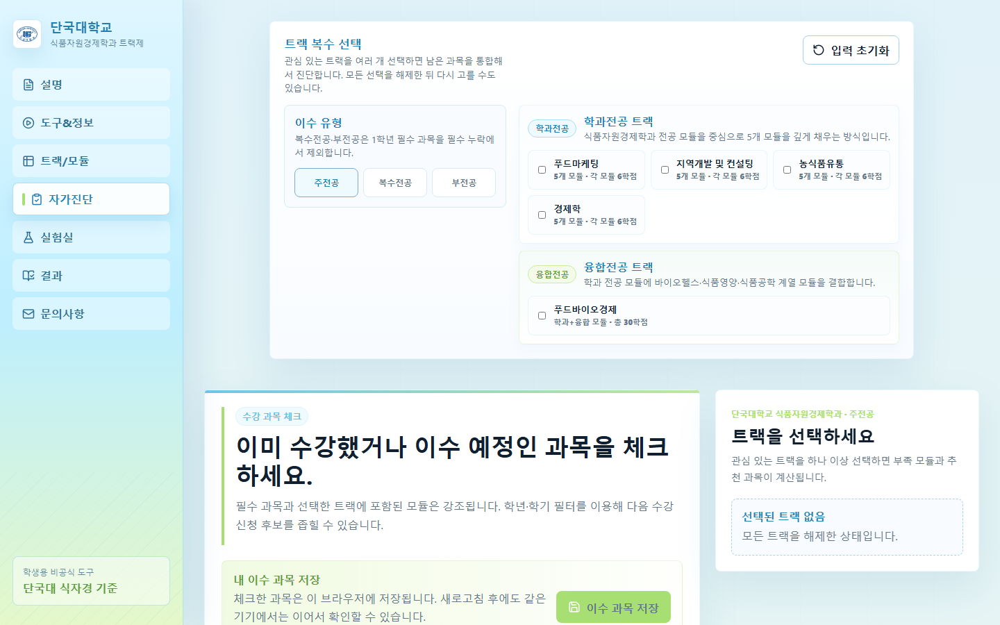

# 단국대학교 식품자원경제학과 트랙제 자가진단

2026학년도 단국대학교 식품자원경제학과 모듈형 트랙제 교육과정을 기준으로, 학생이 관심 트랙과 이수 과목을 체크하면 부족 모듈, 남은 학점, 추천 과목을 확인할 수 있는 정적 웹앱입니다.

## 배포 URL

[https://dku-track-diagnosis.vercel.app](https://dku-track-diagnosis.vercel.app)



## 사이트 목적

트랙제 신청 과정에서 학생이 직접 확인하기 어려운 내용을 한 화면에서 정리하는 것이 목표입니다.

- 내가 선택한 트랙에서 어떤 모듈이 부족한지 확인
- 이미 들은 과목과 앞으로 들어야 할 과목 구분
- 복수 트랙 선택 시 트랙별 충족/부족 상태 비교
- 학년/학기 기준으로 남은 과목 후보 확인
- 실험실 탭에서 현재 이수 과목 기준으로 달성 가능성이 높은 트랙 탐색

이 도구는 자가진단 보조용으로 제작했습니다. 자세한 최종 졸업, 트랙 인정 여부는 학과 공식 안내로 확인해야 합니다.

## 주요 기능

- 트랙제 설명, 트랙/모듈표, 자가진단, 결과, 실험실, 문의사항 탭 제공
- 5개 트랙 기준 모듈 충족 여부 계산
- 복수 트랙 선택 및 트랙별 부족 과목 분리 표시
- 보완 후보 과목을 학년/학기별로 정리
- 이수 과목 브라우저 저장
- 결과 PDF 출력 지원
- Vercel 배포용 `vercel.json` 포함

## 기술 스택

- Vite
- React
- TypeScript
- Vitest
- localStorage

## 실행

```bash
pnpm install
pnpm run dev
```

## 검증

```bash
pnpm run test
pnpm run build
```

## Vercel 배포 설정

- Production URL: `https://dku-track-diagnosis.vercel.app`
- Framework Preset: `Vite`
- Install Command: `npm install`
- Build Command: `npm run build`
- Output Directory: `dist`
- Development Command: `npm run dev`

위 설정은 `vercel.json`에도 고정되어 있습니다.

## 협업 문서

- [변경 기록](CHANGELOG.md)
- [협업 및 커밋 지침](CONTRIBUTING.md)

새 기능을 추가하거나 배포 전 변경이 있으면 변경 목적, 주요 수정 파일, 검증 결과를 함께 남겨주세요.
