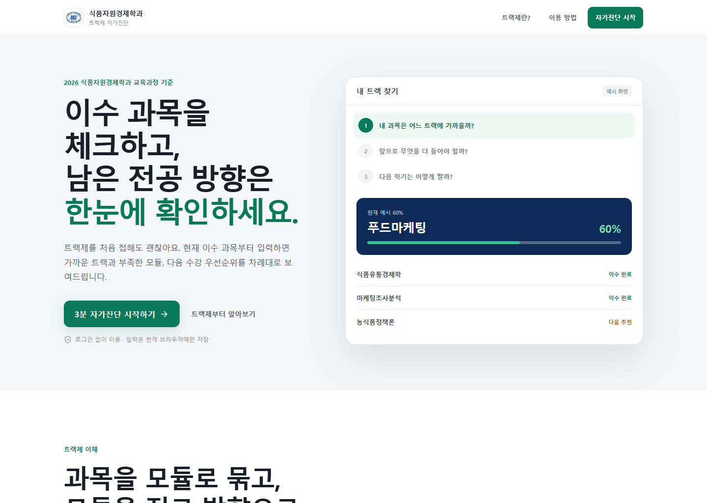

# 단국대학교 식품자원경제학과 트랙제 자가진단

학생이 트랙제를 이해하고 현재 이수 상태를 진단한 뒤 다음 수강 계획을 살필 수 있도록 만든 자가진단 보조 웹앱입니다. 단국대학교와 학과의 공식 공개 교육과정·안내는 규칙 검증의 출발점이며, 현재 화면과 테스트의 계산 입력은 제공된 최종계획을 구조화한 값입니다. 개인별 적용 학번·필수 변형·인정학점과 트랙 이수·졸업 여부는 반드시 학과의 공식 검토가 필요합니다.

## 배포 URL

[https://dku-track-diagnosis.vercel.app](https://dku-track-diagnosis.vercel.app)



## 사이트 목적

안내 자료만으로는 트랙별 모듈, 이수 과목, 부족 과목을 한눈에 파악하기 어렵다는 문제에서 시작했습니다. 교육과정표를 그대로 옮기는 대신 학생이 “지금 무엇을 채웠고, 무엇이 남았는지”를 이해한 뒤 수강신청 행동으로 이어가게 하는 것이 목표입니다.

- 내가 선택한 트랙에서 어떤 모듈이 부족한지 확인
- 이미 들은 과목과 앞으로 들어야 할 과목 구분
- 복수 트랙 선택 시 트랙별 충족/부족 상태 비교
- 학년/학기 기준으로 남은 과목 후보 확인
- 현재 이수 과목 기준으로 가까운 트랙과 함께 고려할 추가 트랙 탐색
- 추천 과목을 다음·다다음 학기 계획으로 나눠 저장

이 도구는 자가진단 보조용으로 제작했습니다. 트랙 이수와 졸업 여부는 학과 공식 안내 및 개별 심사로 확인해야 합니다.

## 2026-08-30 기반 기능 검증 범위

이번 기반 기능은 학생의 소속·이수 경로를 먼저 분리하고, 진단 결과가 어떤 규칙 상태에 근거하는지와 필수·트랙·전체학점 진행도를 나누어 보여 주는 데 집중했습니다. 진단 단계와 선택 과목은 브라우저 저장소(v2) 및 주소 상태로 복원됩니다.

| 구분 | 현재 문서에서의 의미 |
| --- | --- |
| 공식 공개 자료 | 단국대학교와 학과가 공개한 교육과정·안내가 규칙 확인의 출발점입니다. |
| 제공된 최종계획 기준 계산 | 이 앱의 화면·테스트는 제공된 최종계획에 구조화된 규칙과 과목 입력으로 계산합니다. |
| 공식 검토 필요 결과 | 개인의 적용 학번, 필수 변형, 인정학점, 복수전공 최소학점은 학과 확인 전까지 자가진단 참고 결과입니다. |
| 이번 기반 구현 | 소속·이수 경로 설정, 규칙 근거 상태, 분리 진행도, v2 저장 마이그레이션, 주소·새로고침 복원을 구현했습니다. |
| 다음 계획 범위 | 추천 고도화, 졸업계획, PDF 과목 불러오기·자동 채움과 이미지 생성은 이번 기반 검증 범위에 포함하지 않습니다. |

검증 세부 기록과 캡처 해시는 [기반 검증 보고서](reports/validation/2026-08-30-track-foundation-validation.md)에서 확인할 수 있습니다.

## 주요 기능

- 트랙제의 의미·이점과 서비스 역할만 짧게 설명하는 반응형 랜딩페이지
- `자가진단 → 결과 → 학기 계획` 3단계 내부 흐름
- 학년·학기별 목록과 모듈별 목록을 오가는 과목 선택 화면
- 과목명·과목코드 검색과 학년·학기 필터
- 결과의 `한눈에 보기 · 맞춤 트랙 추천 · 부족 모듈 · 필수 과목` 탭
- 5개 트랙 기준 모듈 충족 여부 계산
- 복수 트랙 선택 및 트랙별 부족 과목 분리 표시
- 보완 후보 과목을 학년/학기별로 정리
- 이수 과목과 학기 계획을 서로 구분해 브라우저 저장
- 실제 이수 기준과 계획 포함 기준의 추천 결과 비교
- 사전 존재 기능: 결과 화면의 브라우저 인쇄 대화상자에서 PDF로 저장. 이번 기반 릴리스 게이트의 신규 브라우저 검증 범위에는 포함하지 않음
- Vercel 배포용 `vercel.json` 포함

## 기술 스택

- Vite
- React
- TypeScript
- Vitest
- localStorage

## 실행

```bash
npm install
npm run dev
```

## 검증

```bash
npm test
npm run build
```

## Vercel 배포 설정

- Production URL: `https://dku-track-diagnosis.vercel.app`
- Framework Preset: `Vite`
- Install Command: `npm install`
- Build Command: `npm run build`
- Output Directory: `dist`
- Development Command: `npm run dev`

위 설정은 `vercel.json`에도 고정되어 있습니다.

## 협업 문서

- [변경 기록](CHANGELOG.md)
- [협업 및 커밋 지침](CONTRIBUTING.md)

새 기능을 추가하거나 배포 전 변경이 있으면 변경 목적, 주요 수정 파일, 검증 결과를 함께 남겨주세요.

## 최근 업데이트 기록

### 2026-08-25 실제 서비스형 UX/UI 개편

토스의 `One thing per one page`, TDS의 색상·탭·목록 위계, 당근의 발견 가능성과 실험 중심 사례를 참고해 사용자가 다음 행동을 놓치지 않는 구조로 개편했습니다.

- 랜딩의 반복 섹션과 예시를 줄이고 트랙제 이해, 장점, 3단계 이용 흐름만 남겼습니다.
- 과목 선택은 큰 시간표 대신 읽기 쉬운 행 목록을 기본으로 하고 모듈별 보기와 검색을 추가했습니다.
- 결과에 개인 이수 이력 기준의 맞춤 트랙 추천과 추가 트랙 후보, 공통 도움 과목을 추가했습니다.
- 학기 계획에서 추천 과목을 다음 학기·다다음 학기·나중으로 배치할 수 있게 했습니다.
- 계획 과목은 실제 이수와 분리 저장하며 `계획 포함` 비교에서만 반영합니다.
- 반복 그라데이션과 동일한 카드 격자를 줄이고 네이비·포레스트 그린·쿨그레이의 명암 체계를 적용했습니다.

검증 결과:

- `npm test` 기준 23개 테스트 통과
- `npm run build` 기준 TypeScript 검사 및 Vite 프로덕션 빌드 통과
- 로컬 브라우저에서 랜딩, 목록/모듈 전환, 맞춤 추천, 계획 저장, 모바일 가로 넘침을 확인

남은 리스크:

- 실제 과목 개설 학기와 폐강 여부는 수강신청 시스템 기준으로 달라질 수 있습니다.
- 트랙 인정 기준은 학과 공식 안내가 최종 기준입니다.
- 학기 계획의 수강 전략은 학기당 트랙 보완 과목 2개를 기준으로 한 참고 계산입니다.
